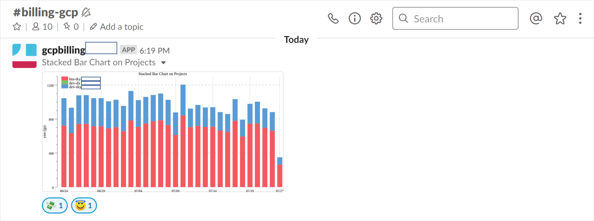

# gbilling-plot
Create graphed invoice for Google Cloud Platform. You can see billing amount per GCP project.


Create graphed invoice for GCP. You can see billing amount per GCP project.

## Usage

This package uses below services.

- Google Cloud Billing（BigQuery）
- Google Cloud Functions
- Google Cloud Pub/Sub
- Google Cloud Scheduler
- Slack API

## Requirements

*Notify GCP Billing to Slack* requires the following to run:

* [Go](https://golang.org/dl/) more than 1.11
    * [Cloud SDK](https://cloud.google.com/sdk/install/)


## Steps

1. [Get Slack API Token](https://get.slack.help/hc/en-us/articles/215770388-Create-and-regenerate-API-tokens)
2. Export your GCP billing to BigQuery ([reference](https://cloud.google.com/billing/docs/how-to/export-data-bigquery))
3. Create Cloud Scheduler
```sh
gcloud beta scheduler jobs create pubsub graph-billing --project "<your project name>" \
  --schedule "50 23 * * *" \
  --topic graph-billing \
  --message-body="execute" \
  --time-zone "Asia/Tokyo" \
  --description "This is scheduler for graph billing."
```
4. Deploy to Cloud Function
```sh
gcloud functions deploy graphBilling --project "<your project name>" \
  --entry-point GraphedBilling \
  --trigger-resource graph-billing \
  --trigger-event google.pubsub.topic.publish \
  --runtime go111 \
  --set-env-vars TABLE_NAME="<your billing table name on bigquery>" \
  --set-env-vars SLACK_API_TOKEN="<your slack api token>" \
  --set-env-vars SLACK_CHANNEL="<your slack channel name>"
```
5. Go to the [Cloud Scheduler page](https://cloud.google.com/scheduler/docs/tut-pub-sub) and click the *run now* button of *graphBilling*

## Example

Sample output is below.



## License

This project is licensed under the Apache License 2.0 License - see the [LICENSE](LICENSE) file for details
